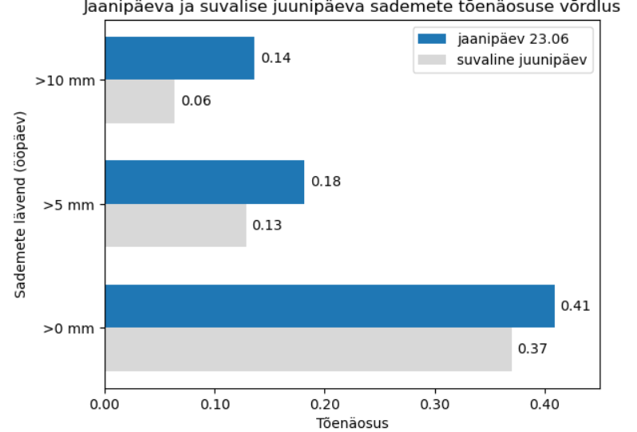
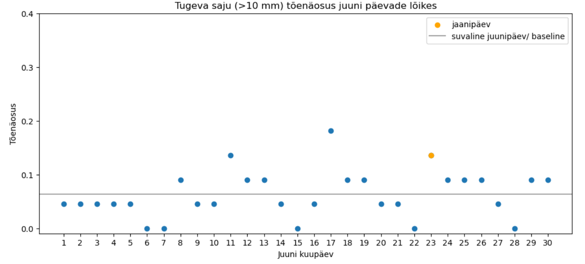

### Mida uurin?
On levinud rahvalik pärimus, et jaanipäeval (23.juuni) sajab. Tekib küsimus, kas jaanipäev on lihtsalt üks sajustest päevadest või sajutõenäosuse poolest eristuv päev?
Eesmärk on ajaloolisi sademete andmeid kasutades:
- määrata  baastase ehk üldine saju tõenäosus, kui valida suvaline juunipäev, arvestamata konkreetset kuupäeva. 
- hinnata, kui tõenäoline on sadu jaanipäeval ning kuidas see erineb baastasemest.
- uurida, kuidas juuni kuupäevade sajutõenäosused baastaseme suhtes jaotuvad ning kas mõni kuupäev (nt jaanipäev) eristub kõrgema sajutõenäosusega.

### Andmed
Keskkonnaagentuuri Ilmateenistus:
https://www.ilmateenistus.ee/kliima/ajaloolised-ilmaandmed/
Algandmed: Tallinn-Harku 2004-2025.Tunnipõhised vaatlused (Excel).
Edasiseks kasutamiseks salvestan CSV formaati ning koondan tunnipõhised vaatlused ööpäevasteks summadeks.

### Metoodika
Andmete ettevalmistamisel kontrollin veerunimed, andmetüübid ja puuduvad väärtused. Ühendan tabelid, eraldan sademete andmed ning loon edasiseks analüüsiks ühtse CSV-faili. 
Seejärel filtreerin välja ainult juuni andmed ja koondan ööpäevasteks.

Esmase ülevaate saamiseks vaatan 23. juuni sademete hulka aastate lõikes. Selgub, et varieeruvus on suur: enamikul aastatel on sademeid vähe või üldse mitte, kuid üksikutel aastatel on sadu väga tugev, mis mõjutab keskmist. See aitab otsustada sadu defineerivad lävendid: >0 mm (sademeid üldse) ; >5 mm (mõõdukas sadu); >10 mm (tugev sadu).

Tõenäosused arvutan sagedusena ehk osakaaluna kõikidest vaatlustest. Kokku on 22 aasta ööpäevased vaatlused. See tähendab, et baastase arvutatakse 660 vaatluse põhjal ning iga konkreetse kuupäeva tõenäosus 22 aasta vaatluse põhjal. Tulemused visualiseerin graafikutel.

### Tulemused
Jaanipäeval on saju tõenäosus kõigi lävendite korral veidi suurem kui juunikuu üldine baastase.

Suurim  erinevus on tugeva saju korral (>10 mm). Jaanipäev kuulub sel juhul pigem kõrgema sajutõenäosusega päevade hulka, kuid ei eristu selles grupis teistest päevadest.

### Kuida notebooki kasutada
Ava fail Ilmaandmed_Clean.ipynb Jupyter Notebookis või JupyterLabis ja käivita kõik cellid (Run all). Analüüs on tehtud Pythonis (Anaconda, Jupyter Notebook). Vajalikud on Pythoni teegid:  pandas, numpy ja matplotlib.

### Edasised võimalused
Andmed laadisin alla käsitsi Ilmateenistuse veebist ja teisendasin peale kontrollimist CSV-formaati. Ilmateenistus pakub osaliselt ka API-põhist ligipääsu, mida oleks võimalik kasutada andmete automaatseks laadimiseks.

Andmete puhastamise ja ettevalmistuse tegin selles töös analüüsi käigus samm-sammult. Seda oleks võimalik edasi arendada, et andmete laadimine ja puhastamine toimiks ühtse voona.

Praegune lahendus on üles ehitatud konkreetse ilmajaama ja ajaperioodi jaoks. Funktsioonide abil saaks analüüsi üldistada, et rakendada sama loogikat teistele ilmajaamadele ja perioodidele.

### AI kasutamine
AI abi kasutasin koodi kirjutamise ja Python/pandas/matplotlib kasutamisega seotud küsimuste selgitamiseks ning GitHubi ja README koostamise juhendamiseks.
